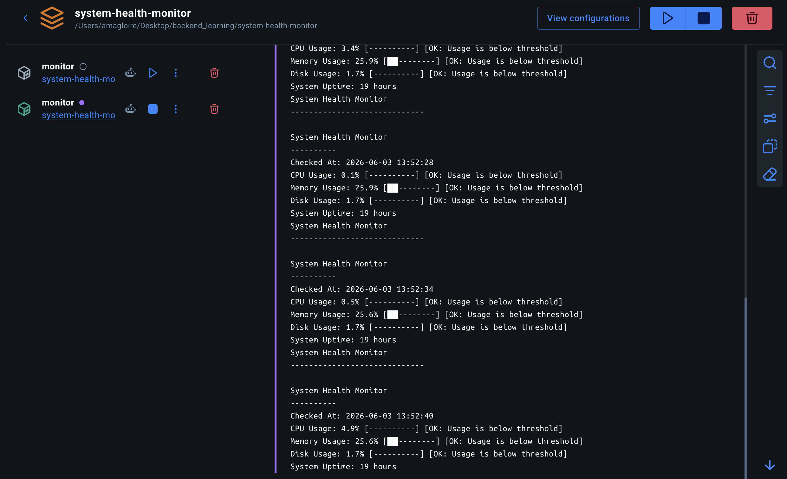

# System Health Monitor 

A Python-based system monitoring application that tracks CPU, memory, disk usage, and uptime with threshold-based alerts, logging, Docker support, and a FastAPI dashboard.

**日本語**：CPU、メモリ、ディスク使用量、稼働時間を監視するPythonベースのシステム監視アプリケーションです。しきい値に基づくアラート、ログ記録、Docker対応、FastAPIダッシュボードを備えています。

## Screenshot / スクリーンショット



# Features | 機能 

| English | 日本語 | Status
| --- | --- | --- |
| CPU, memory, disk, and uptime monitoring | CPU、メモリ、ディスク、稼働時間の監視 | ✅ Complete |
| Warning and critical threshold detection | 警告および重大なしきい値の検出 | ✅ Complete |
| Slack alert integration | Slackアラートとの連携 | ✅ Complete |
| Email alert integration | メールアラートとの連携 | ✅ Complete |
| Logging support | ログ記録のサポート | ✅ Complete |
| Docker container support | Dockerコンテナのサポート | ✅ Complete |
| FastAPI web dashboard | FastAPIウェブダッシュボード | ✅ Complete |
| `/health` JSON endpoint | `/health` JSONエンドポイント | ✅ Complete |
| Configurable thresholds using environment variables | 環境変数によるしきい値の設定 | ✅ Complete |
| EN/JP code comments for learning and review | 学習と復習のための英語/日本語コードコメント | ✅ Complete |
| GitHub Actions CI | GitHub Actions CI | 🚧 Planned |
| Dashboard UI improvements | ダッシュボードのUI改善 | 🚧 Planned |
| Add automated tests | 自動テストを追加 | 🚧 Planned |
| Add historical monitoring charts | 履歴監視チャートを追加 | 🚧 Planned |
| Add log filtering | ログフィルタリングを追加 | 🚧 Planned |
| Add deployment documentation | デプロイメントドキュメントを追加 | 🚧 Planned |

## Sample Log Output / サンプルログ出力
A safe sample monitoring log is available here:
```text
examples/health_log.txt
```
This sample file is included for demonstration purposes. Real runtime logs are stored locally in the logs/ folder and are excluded from Git.

デモ用の安全な監視ログサンプルは以下に配置しています。
```text
examples/health_log.txt
```
実行時に生成される実際のログは logs/ フォルダに保存されますが、ローカル環境の情報を含む可能性があるため、Git管理から除外しています。

### Environment Variables / 環境変数

This project uses environment variables for alerting and threshold configuration.
**日本語**: アラート設定としきい値設定に環境変数を使用します。

# Tech Stack | 技術スタック 

- Python
- FastAPI
- Docker
- Docker Compose
- psutil
- colorama
- Slack Webhooks
- SMTP Email
- Git/GitHub

# Installation / インストール

Clone the repository/ リポジトリのクローン:
```bash
git clone https://github.com/Iris408/system-health-monitor.git
cd system-health-monitor
```
Install dependencies/ 依存関係のインストール:
```bash
pip install -r requirements.txt
```
Run the monitor/ 監視スクリプトの実行:
```bash
python3 main.py
```

# Docker Usage / Dockerでの起動

This project can run inside a Docker container using Docker compose.
**日本語**:Docker Composeを使用してDockerコンテナ内で実行できます。

Build and run the container/ ビルドして起動:
```bash
docker compose up --build
```
Run in the background/ バックグラウンドで起動:
```bash
docker compose up -d
```
View logs/ ログの確認:
```bash
docker compose logs
```
Stop the container/ コンテナの停止:
```bash
docker compose down
```

# Project Structure / プロジェクト構成
```text
system-health-monitor/
├── alerts.py
├── dashboard.py
├── docker-compose.yml
├── Dockerfile
├── email_alerts.py
├── examples/
│   └── health_log.txt
├── logger.py
├── main.py
├── README.md
├── requirements.txt
└── screenshots/
    └── system-health-monitor.png
```

# FastAPI Dashboard / FastAPI ダッシーボド
The project includes a FastAPI dashboard and a /health JSON endpoint for viewing system monitoring data through a browser or API client.

**日本語**:ブラウザやAPIクライントからシステム監視データを確認できるFastAPIダッシボードと/health JSONエンドポイントが含まれています。

Local URLs / ローカルURL
| Page | URL |
| --- | --- |
| Dashboard | http://localhost:8000 |
| Health Endpoint | http://localhost:8000/health |
| Swagger UI | http://localhost:8000/docs |